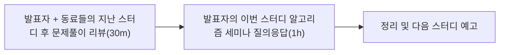

# AlgorithmStudy

Passionate about algorithms and eager to improve skils!

## 📝 Study

### 📚 Syllabus

|Date|Lecture|presenter|
|---|:---:|:---:|
|08.31|Brute Force, Recursion|@KDW|
|09.07|Math algorithm basic|@MHS|
|09.14|asymptotic notation|@LHK|
|08.31|Stack, Queue, Deck|@MHS|
|09.07|Heap, Binary Heap|@LHK|
|09.14|Hashing|@KDW|
|09.21|Sorting||
|09.28|Binary Tree||
|10.05|Review||


### 📅 Meeting Date
We meet every **Saturday at 9:30 AM**. 
The meeting is will be held online via **Zoom☀️**. 



### 📂 Directory Structure

```
├ Root
   ⎮    ├ 📁 Name or initial
   ⎮    ⎮    ├ 📁 BOJ
   ⎮    ⎮    ⎮   ├︎ 📃 Solution   ex) [1111]전자레인지.py
   ⎮    ⎮    ├ 📁 LeetCode
   ⎮    ⎮    ⎮   ├︎ 📃 Solution   ex) [1112]Sort.java
   ├ 📝README.md (for Study Context)
```

- Don't have to worry about how write solution title. that free.
-  Make sure to write the following at **the top of the file**.

```py
'''
Author    : Name
Date      : 2024.01.01(Mon)
Runtime   : 42352 KB
Memory    : 816 ms
Algorithm : Binary Search
'''
```

- if you want to confirm Runtime and Memory about Code, Use `test.py`
```
python test.py --file ./Algorithm-Study/KDW/leetcode/[1111]do.py
```

### 💡 Commit 

```
Feat: 새로운 문제 풀이 추가
Refactor: 코드 리뷰로 인한 재풀이
Fix: 풀이 수정
Comment: 주석 추가
Rename: 파일, 폴더명 수정
Remove: 파일, 폴더 삭제
```

## 🫂 Members

|Name|Github|Language|
|---|:---:|:---:|
|LHK|[](https://github.com/HakyoungLEE)|<span></span>|No text|
|KDW|[](https://github.com/dongwoodev)|<span></span>|SON said "기본기가 탄탄해야 성공한다."|
|MHS|[](https://github.com/solso318)|<span></span>|No text|


### 💻 More info
- **Attendance**: Regular attendance is mandatory. If you cannot attend a meeting, inform the team in advance.
- **Preparation**: Each member must solve the weekly assigned problems and upload their solutions to the respective folder before the meeting.
- **Participation**: Active participation in discussions is required. Be ready to explain your solutions and approaches.
- **Respect**: Maintain a respectful and supportive environment for all members.

- [More info...](https://dustinlab.notion.site/a2a4b75c128c45c2a72633f7b69134a8?pvs=4)
